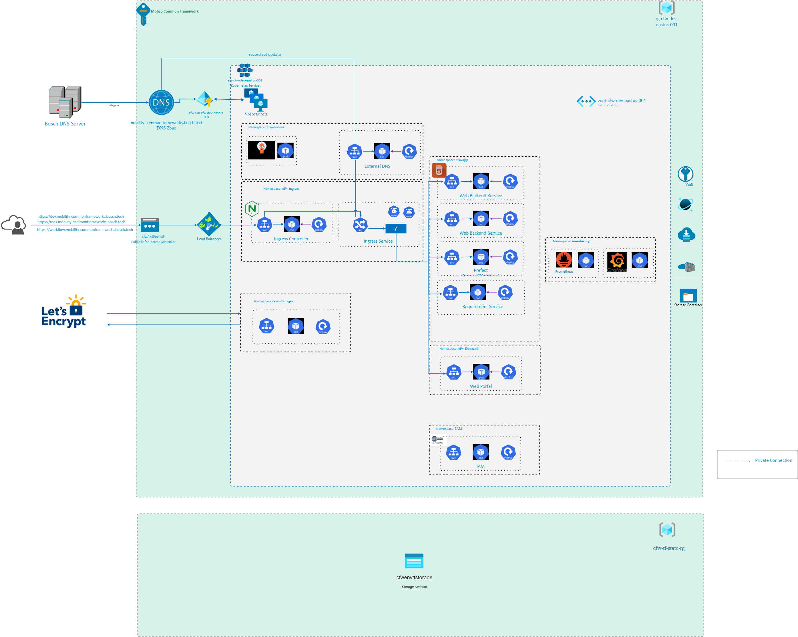
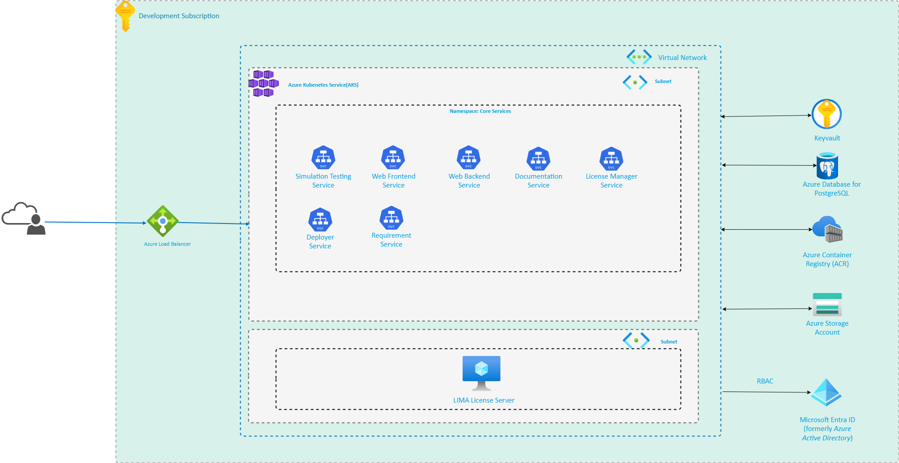

# System Architecture Overview

## Application Gateway

- **Reverse-proxy L7 (NodeJs, Python)**  
  - **Benefits**: Manage the endpoint by code
- **Application Gateway L7**  
  - Manage certificate + WAF  
  - Manage endpoint – use 1 wildcard routing → ingress (proxy) in K8S
- **Load Balancer L4**

---

## Resource Group

- **Specific environment RG**: AKS, Key Vault, ...
- **Terraform state – generic RG**
- **CFW-VM RG**:  
  - VM 24/7  
  - Bastion host – deny public access RDP/SSH

---

## Bosch Artifactory (Whitelisting – JFROG)

- npm
- Conan
- Maven
- Docker image
- Helm
- Packaging

**Internal tool/service**  
For embedded team purpose.  
**Internal usage / not publicly accessible**

---

## Azure Container Registry (Public Accessible / External Usage)

- Docker image
- Helm
- Deploy tool/service
